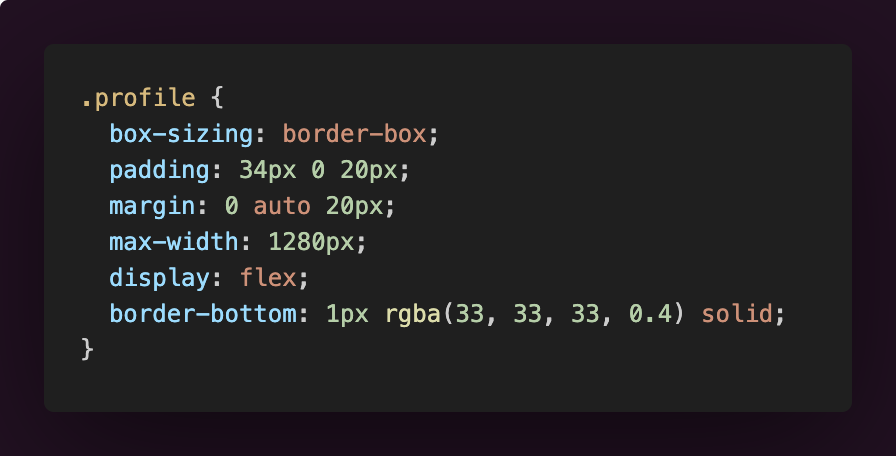
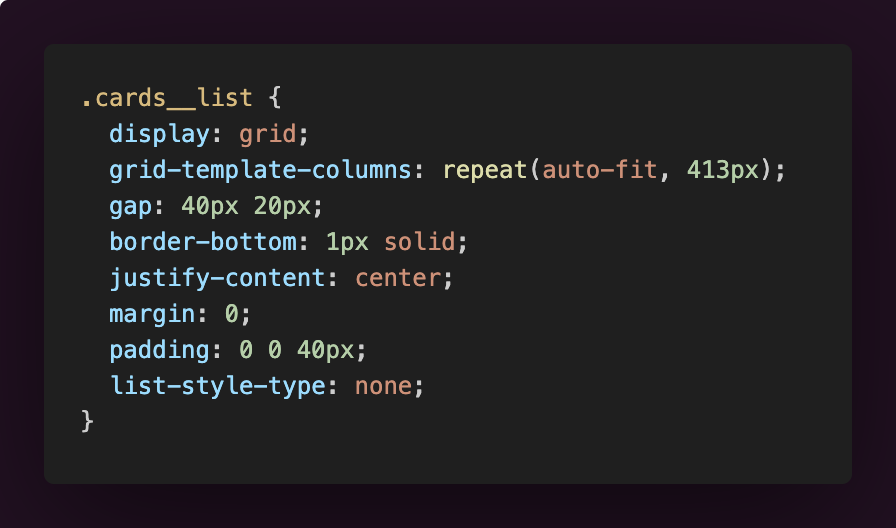
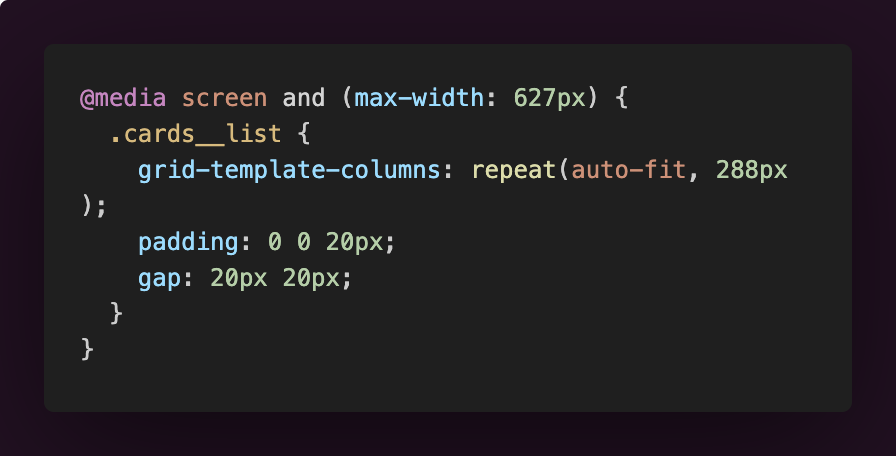

# Spots App

## A social media app where users can share and like pictures of each-other about places that they have visited.

## Tech Stack

- HTML
- CSS
- Responsive design - using Flexbox and grid

**Intro**

This project is made so all the elements are displayed correctly on popular screen sizes. For this, flexbox and grid was used. In addition, media queries were used, to make elements change size to look better on smaller devices.

**Images**

_Using a flexbox for the profile section with horizontal margins 'auto' so it is always centered to the page_

_Cards List using grid and columns template autofit for fitting images automatically on each row with a width of 413px_

_Using media query to make image size of cards smaller for devices with screen sizes up to 627px_

**GitHub Pages**

Check out my work on GitHub Pages by clicking this [link](https://6ent1.github.io/se_project_spots/).
